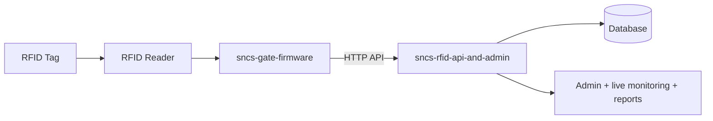

# RFID Turnstile Attendance Monitoring

> [!info]
> Use this page as your main documentation hub. Edit the placeholders with your exact hardware/software details.

---
title: RFID Turnstile Attendance Monitoring
tags: [rfid, attendance, turnstile, project]
status: in-progress
---

## 1) Overview

What this system does:
- A staff/student taps an RFID tag at a turnstile/reader.
- The reader (through a microcontroller) sends the tag id to the attendance server.
- The server records a check-in/check-out event and updates dashboards/reports.

Project goals:
- Record entries reliably
- Prevent duplicate scans (tune cooldown window)
- Support time-based rules (e.g., late/early)

## 1.1) Repositories (two-repo layout)

| Repository | Responsibility |
|-------------|------------------|
| **sncs-rfid-api-and-admin** | Single deployment: **HTTP API** for gates, **admin** (Inertia/React), **live monitoring**, **reports**, SMS/queue, database migrations. |
| **sncs-gate-firmware** | On-gate firmware (e.g. ESP32 / Arduino-class): RFID read, relay, offline store-and-forward, heartbeat/whitelist sync. |

Architecture detail, endpoints, and SMS rules: [[SNCS-RFID-API-and-Admin]].

## 2) What you currently have

- Hardware folder (what you meant by `D:\\RFID TURNSTILE`): `PUT_PATH_OR_NOTE_REFERENCE_HERE`
- RFID reader model:
  - `PUT_MODEL_HERE` (e.g., MFRC522 / RC522 / PN532)
- Microcontroller:
  - `PUT_MODEL_HERE` (e.g., Arduino Uno / ESP32 / Raspberry Pi Pico)
- Computer/server:
  - OS/host: `PUT_HERE`
  - Server stack: Laravel 13 + Inertia (React) — **sncs-rfid-api-and-admin** (API + admin + monitoring in one app)
- Connection type:
  - `Serial / Wi-Fi / USB / Ethernet`

## 3) System architecture (high level)



## 4) Hardware setup

### 4.1 RFID reader wiring

Add your exact pin mapping here.

| Reader Pin | MCU Pin | Notes |
|---|---|---|
| VCC |  | Voltage |
| GND |  | Ground |
| SDA/SSEL |  | SPI chip select |
| SCK |  | SPI clock |
| MOSI |  | SPI data in |
| MISO |  | SPI data out |
| RST |  | If applicable |

### 4.2 Turnstile behavior

- Is the turnstile controlled automatically by the same system?
  - `YES/NO`
- If yes, what controls it?
  - `RELAY / SOLENOID / MOTOR DRIVER / OTHER`
- Any sensor for direction (entry/exit)?
  - `YES/NO`
  - details: `PUT_HERE`

## 5) Firmware / device code

### 5.1 Reading RFID

- Tag ID format:
  - `UID 4 bytes / UID 7 bytes / custom payload`
- UID normalization:
  - uppercase/lowercase: `PUT_HERE`
  - separators: `none` / `:` / `-`
- Scan cooldown (to reduce duplicates):
  - `PUT_SECONDS_HERE` seconds

### 5.2 Sending to server

What the device sends (example payload):

```json
{
  "device_id": "TURNSTILE_01",
  "tag_uid": "04AABBCCDD",
  "event_type": "checkin",
  "timestamp": "2026-05-13T10:30:00Z"
}
```

Server endpoint:
- Method: `POST`
- URL: `PUT_HERE`
- Auth:
  - `none / API key / JWT / HMAC`

Retry rules:
- retry interval: `PUT_HERE`
- max retries: `PUT_HERE`

## 6) Server-side handling

### 6.1 API flow

1. Validate payload
2. Normalize/lookup the tag (RFID UID -> user)
3. Determine whether this is check-in or check-out
4. Apply anti-duplicate window
5. Store event + update user status

### 6.2 Data model (tables/entities)

Add your real fields once you map them to your DB:

| Entity | Key fields |
|---|---|
| User/Member | id, name, tag_uid(s) |
| RFID Tag | uid, assigned user |
| Attendance Event | timestamp, device_id, uid, event_type, status |
| Device | device_id, location, enabled |

## 7) User workflow

### Staff/student check-in
- Approach turnstile
- Tap RFID tag
- Confirm: (UI message / LED / buzzer / log)

### If a scan fails
- Retry after `PUT_SECONDS_HERE`
- Re-seat/clean reader
- Check server logs

## 8) Calibration and validation checklist

```text
[ ] Confirm reader can reliably read UID (test 20 scans)
[ ] Confirm UID formatting matches server expectation
[ ] Confirm cooldown prevents duplicates
[ ] Confirm correct event_type (checkin vs checkout)
[ ] Confirm time zone handling (device vs server)
[ ] Confirm network resilience (offline retry / device queue if needed)
```

## 9) Troubleshooting

### Problem: UID is not recognized
- Verify UID formatting (case + separators)
- Confirm tag is enrolled in the server DB
- Confirm device sends the same field name the server expects

### Problem: Duplicate entries
- Increase cooldown
- Improve device debounce logic
- Add server-side dedupe by (device_id, uid, time window)

### Problem: No data reaches server
- Verify connectivity (Wi-Fi/serial)
- Check API endpoint URL
- Check auth headers/keys
- Check server logs and device retry behavior

## 10) To-do (fill as you go)

## 11) Links

- Gate firmware repo: **sncs-gate-firmware** — `PUT_REMOTE_URL_OR_PATH_HERE`
- Server + admin app (this monorepo): **sncs-rfid-api-and-admin**
- Deep dive (API, SMS, DB, tokens): [[SNCS-RFID-API-and-Admin]]
- Wiring diagram: `PUT_LINK_HERE` or attach images in Obsidian

